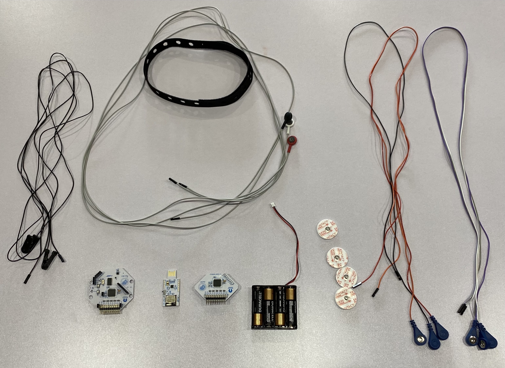
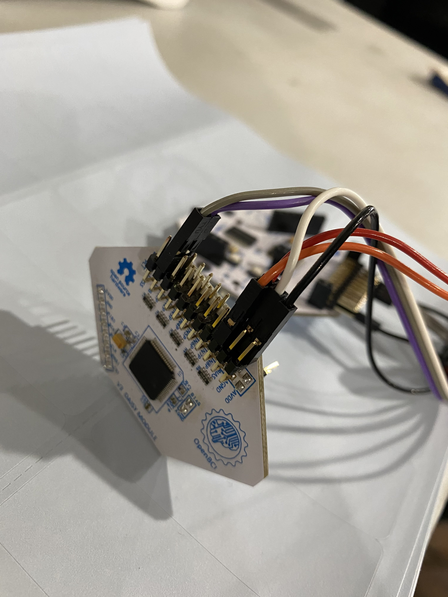
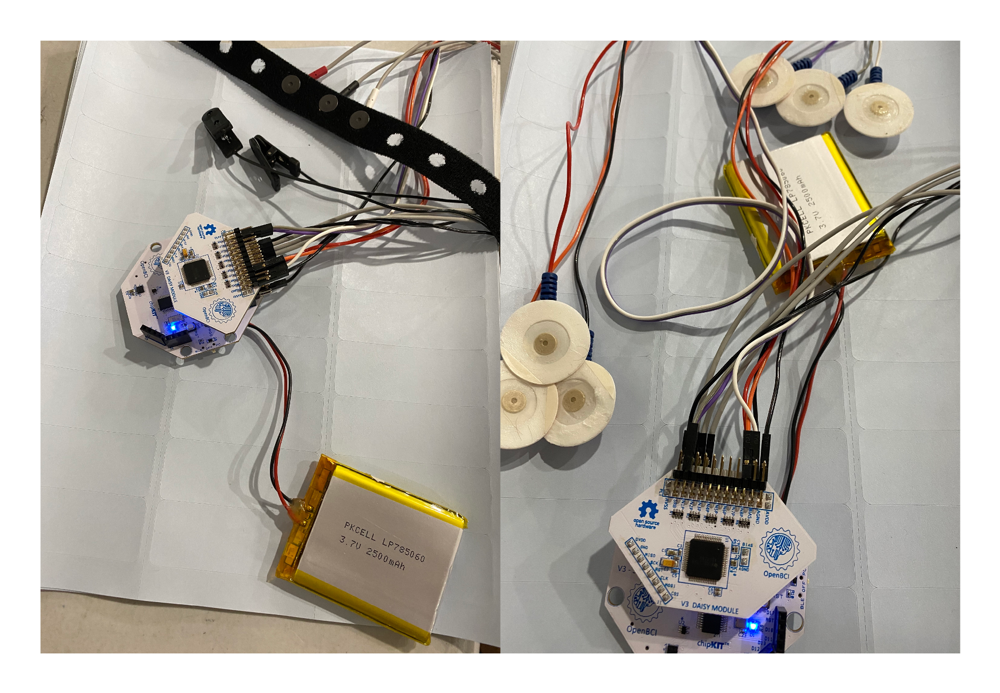
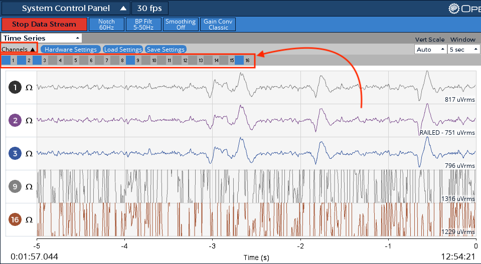
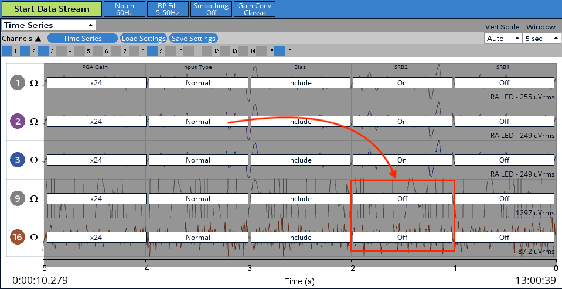

OpenBCI Cyton+Daisy board offers a wide range of flexibility with more signal channels. 
This tutorial will show you how to set up reading EEG (electroencephalography), EMG (electromyography), 
ECG (electrocardiogram) data at the same time.

After going through this document, you will learn one configuration for setting up multiple ExG recordings
at the same time. You could apply the same principle to build channel layouts to fit your application (i.e., 
3-lead ECG vs. 5-lead ECG; eight or more EEG channels).

## Preliminary

Before starting this tutorial, we recommend you go through at least one of the following guides to familiarize with OpenBCI 
pipeline before starting this doc:

-   [EEG](01-EEG-Setup.md): scalp surface recording brain activity. [Learn more](https://en.wikipedia.org/wiki/Electroencephalography)  
-   [EMG](02-EMG-Setup.md): forearm measurement of muscle nerve signals [Learn more](https://en.wikipedia.org/wiki/Electromyography)
-   [ECG](03-ECG-Setup.md): \[measure heart rhythm on the chest [Learn more](https://en.wikipedia.org/wiki/Electrocardiography)

* * *

**Note**

Sometimes we use ECG and EKG interchangeably, as they are the same thing. This modality measures the electrical activity of muscles in the heart.

* * *

## Materials Needed

Here's a list of material you will need for this tutorial:

1.  EEG hardware, can be one of the following Ultracortex
    [Headband kit](../../04AddOns/01-Headwear/03-Headband_Tutorial.md)
    , [Ultracortex Mark IV](../../04AddOns/01-Headwear/01-Ultracortex-Mark-IV.md)
    , [Ultracortex Mark III](../../04AddOns/01-Headwear/02-Ultracortex-Mark-III-Nova-Revised.md)
    , [Electrode Cap](../../04AddOns/01-Headwear/04-Electrode_Cap_Tutorial.md); we will be using
       the [Headband kit](../../04AddOns/01-Headwear/03-Headband_Tutorial.md) in this tutorial.
2.  EMG/ECG hardware including [Skintact sticky electrodes](https://shop.openbci.com/collections/frontpage/products/skintact-f301-pediatric-foam-solid-gel-electrodes-30-pack?variant=29467659395) or [IDUN Dryode](https://shop.openbci.com/collections/frontpage/products/idun-dryode-kit)
    and [EMG/ECG Snap Electrode Cables](https://shop.openbci.com/collections/frontpage/products/emg-ecg-snap-electrode-cables?variant=32372786958)
3.  OpenBCI [Cyton Board + Daisy Board](https://shop.openbci.com/collections/frontpage/products/cyton-daisy-biosensing-boards-16-channel?variant=38959256526)
    and the Cyton bluetooth USB dongle
4.  Computer with [OpenBCI GUI](../../06Software/01-OpenBCISoftware/01-OpenBCI_GUI.md)

## Channel requirements

EEG, EMG, and ECG have different channel requirements. The labels for the channels can be found below the pin on the boards.
Here we call BIAS, AGND, and SRB the reference channels as they provide reference to the data channels. The data channels are
N1P-N8P. The data streams come from the data channels. Each channel come with a top and bottom pin

Here are the reference channels needed for EEG, EMG, and ECG, respectively.

-   EEG: two reference channels - one SRB, and one BIAS
-   EMG: one reference channel - AGND
-   ECG: one reference channel - BIAS

, where SRB serves as a reference for the EEG channels. AGND is the common ground in measuring the
voltage activity. BIAS is used for noise-canceling; it combines the common noise on all channels and is subtracted from
 the data channels.

## Hardware setup

We are going to use the pins on Cyton to connect the EEG, and use Daisy to connect
to EMG and ECG.

First, [attach Daisy to Cyton](https://shop.openbci.com/collections/frontpage/products/cyton-daisy-biosensing-boards-16-channel?variant=38959256526)
if they are not already attached.

### Setting up 3-lead ECG and forearm EMG

We take six [EMG/ECG Snap Electrode Cables](https://shop.openbci.com/collections/frontpage/products/emg-ecg-snap-electrode-cables?variant=32372786958) and 6
[Skintact sticky electrodes](https://shop.openbci.com/collections/frontpage/products/skintact-f301-pediatric-foam-solid-gel-electrodes-30-pack?variant=29467659395). Attach the 
sticky electrodes to the cables. Use three sticky electrodes for ECG and the other three is for EMG.

For **ECG**, connect two cables to **N1P** top and bottom pin, connect the remaining one to bottom pin of **BIAS**.
Attach the electrodes to your chest, the recommended layout is described in the [ECG tutorial](../../GettingStarted/02-Biosensing-Setups/03-ECG-Setup.md).
For note on ECG signal quality, you can refer to the section _Improving Signal Quality_ in the [ECG tutorial](../../GettingStarted/02-Biosensing-Setups/03-ECG-Setup.md).

For **EMG**, connect two cables to **N8P** top and bottom pin, and the remaining one to **AGND**.
Attach the electrodes to your arm, the recommended layout is described in the [EMG tutorial](../../GettingStarted/02-Biosensing-Setups/02-EMG-Setup.md).

* * *

**Note**

Please refer to the [ECG tutorial](../../GettingStarted/02-Biosensing-Setups/03-ECG-Setup.md) for alternative 5-lead ECG setup.

* * *

### Setting up 3-channel EEG

Here we will show how to connect to a 3-channel EEG with EMG and ECG on the same board at the same time. 
You can later increase the number of EEG channels based on your needs as long as there enough signal (analog)
channels (the data channels NxP) on your board.

We will connect the EEG to Cyton, as shown in the following image. The two ear clips go in **SRB** and **BIAS** bottom pins. The
three electrode cables connect to the bottom pins of **N1P, N2P, and N3P**.

The image above shows using a lithium battery. It is equivalent to use a battery pack powered by
four AA batteries.

The complete setup should look like this

## Visualizing the data in OpenBCI GUI

If you don't have the GUI installed, please refer to [this guide](https://docs.openbci.com/docs/06Software/01-OpenBCISoftware/GUIDocs) to learn
about how to set up the OpenBCI GUI for your operating system.

Attach battery, power on the board in Bluetooth mode by flipping the switch towards the top of the board (where the
pins are). Connect the USB dongle to your computer. Flip the switch on the dongle, so it's at GPIO6 (closer to the USB port).

Open the [OpenBCI GUI](https://docs.openbci.com/docs/06Software/01-OpenBCISoftware/GUIDocs), select CYTON (live) -&gt;
Serial (from Dongle) -&gt; 16 CHANNELS. Click AUTO-CONNECT. Note that we are not using all 16 channels, we are going to turn
off the channels that we don't use in the GUI.

Turn off the channels that we are not using. EEG is on channels 1, 2, 3. EMG is on channel 8.
ECG is on channel 16.

Go to Hardware Settings (at the right of 'Channels'), turn off SRB for channels 9 and 16. These are the EMG and 
ECG channels.

If everything connects correctly, you should see the 3-channel EEG, ECG, and EMG in the GUI. Check
the following GIF for some signature signal in these physiological data streams.

