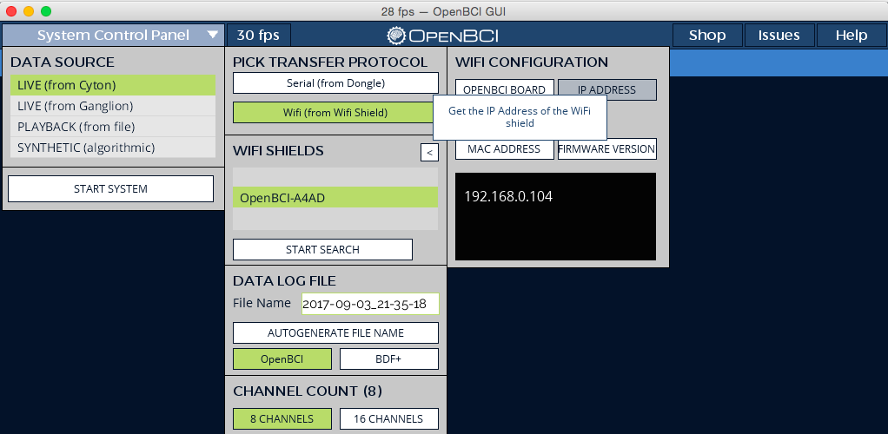
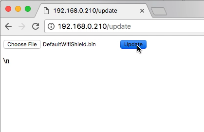
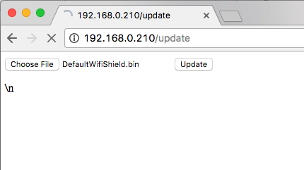
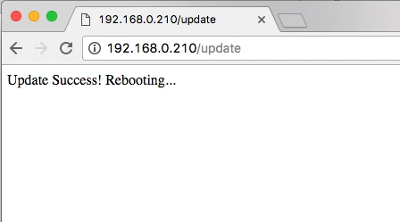
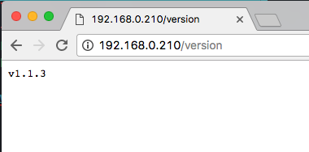
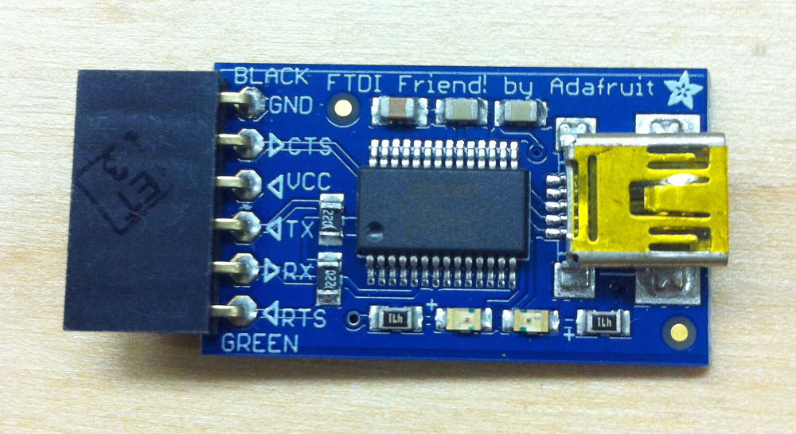
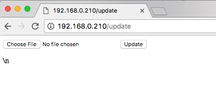
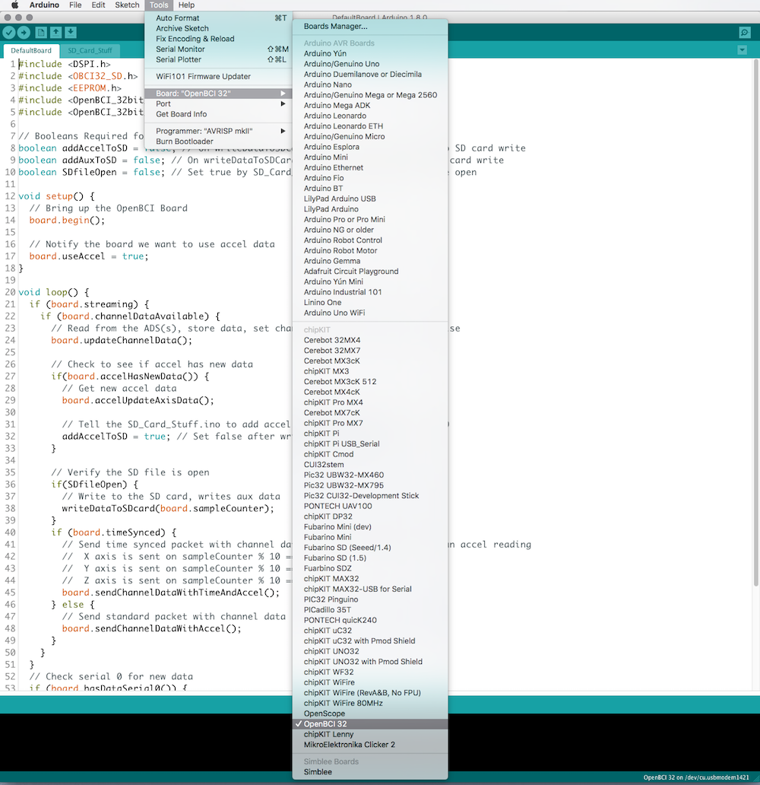

## Overview

The easiest way to update your OpenBCI Wifi Shield Firmware is Over-The-Air (OTA). You can also update firmware through a direct connection to the serial port on the WiFi Shield itself. For the wired programming, you can use the USB dongle that comes with the Cyton as a pass through or you can use a standard [FTDI UART to USB Breakout board](#program-openbci-wifi-with-ftdi-boards).

## Program WiFi Shield Over The Air

### Use Any Web Browser

Pick your default web browser


### Download the WiFi Shield Firmware

First, download the file called `DefaultWifiShield.bin` from the latest release [OpenBCI_WiFi Github repository](https://github.com/OpenBCI/OpenBCI_WIFI/releases/latest).

Save to your downloads folder.


### Isolate and Power WiFi Shield

Next **remove your wifi shield from the Cyton or Ganglion** if it's not already.

Plug a battery into the WiFi Shield and power the Shield by turning the power switch to the `ON` position.

### Get WiFi Shield on Your Wireless Network

Then [get your WiFi Shield on your local wireless network](GettingStarted/Boards/03-Wifi_Getting_Started_Guide.md#get-the-wifi-shield-on-your-wireless-network) if it's not already.

### Get Address of WiFi Shield

Find the IP Address of your WiFi Shield by clicking the '&gt;' button in the WiFi section of the Control Panel, and then clicking the IP Address button, as shown in the image below:



If you're having issues with that step, here's a more in-depth tutorial on using the OpenBCI_GUI to get [your shields ip address](GettingStarted/Boards/03-Wifi_Getting_Started_Guide.md#get-wifi-shield-ip-address).

### Go to /update Page of WiFi Shield

Navigate to http: where `` is the IP Address of your WiFi Shield found in the step above.


On mac, you may use your shields unique name instead of the ip address; i.e.  where `` is your devices unique identifier. Either option works on Mac.


### Select Binary File to Upload

Now select the `` button and from the drop down selected the `` which you downloaded earlier


### Update the Firmware

Then select `` to start the update process


The page will hang for about 10-15 seconds, this the firmware being uploaded.


Then you will see a success message appear, your WiFi Shield is now rebooting, please continue to wait for about 30 seconds.

**Note:** on some browsers, the page will not automatically refresh. If you've waited more than 30 seconds for the success message to appear, skip to the next step and see if it works. If it doesn't try the above step again.



### Verify New Version Number

Once your web browser refreshes itself and the update page is displayed again, you may navigate to the version page and verify your wifi firmware version matches the version you downloaded. If the version is not correct, then be sure you removed your WiFi Shield from a Cyton or Ganglion and try again.



## Hardware for Wired upload

### Program OpenBCI Wifi with FTDI Boards

There are many, many FTDI chip breakouts and cables out there that you can use. Here are a couple examples of popular devices.

### FTDI Friend




Another example would be the [FTDI Friend](http://www.adafruit.com/products/284) from Adafruit. I cut the trace on the RTS and 5V pads as well. These are the correct settings for uploading to ESP8266 using FTDI Friend. These breakouts are awesome and how the board was developed.

### FTDI Basic Breakout


Sparkfun makes an FTDI breakout as well, and they come in a couple of flavors. 5V and 3V. By now, you know that you want the [3V Version](https://www.sparkfun.com/products/9873). [pic coming soon] Also, if you have a version of this board with a voltage selection on the back, make sure that it has the 3.3V pads connected and the 5V pads cut!  

### OpenBCI Cyton Dongle

The OpenBCI Dongle can be used to upload firmware to ESP8266. [See the section](Cyton/06-Cyton_Radios_Programming_Tutorial.md#upload-pass-thru-radio-firmware-version-2xx-fall-2016) on how to [pass through the code](Cyton/06-Cyton_Radios_Programming_Tutorial#program-device-radio-with-openbci-dongle) in the [Cyton Radio Programming Guide](Cyton/06-Cyton_Radios_Programming_Tutorial.md).

## Download Compiled Binary for Upload

### Install Python Dependency

You will need [either Python 2.7 or Python 3.4 or newer](https://www.python.org/downloads/) installed on your system.

### Download and Install esptool

The latest stable `` release can be installed from [pypi](http://pypi.python.org/pypi/esptool) via pip:

```


```

With some Python installations this may not work and you'll receive an error, try `` or ``.

After installing, you will have `` installed into the default Python executables directory and you should be able to run it with the command ``.

In Windows, we use Command Prompt.

### Download the WiFi Shield Firmware

First, download the file called `` from the latest release [OpenBCI_WiFi Github repository](https://github.com/OpenBCI/OpenBCI_WIFI/releases/latest).

Save to your downloads folder.


### Get the Serial Port of Programmer

The correct serial port for your OpenBCI Dongle or FTDI friend will be

```


```

### Connect WiFi Shield to Programmer

Hook up the FTDI friend, OpenBCI Dongle, or other UART-USB programmer to the Wifi Shield. **Don't power the Wifi shield through the FTDI friend.**

| FTDI_Friend | Wifi Shield |
| ----------- | ----------- |
| GND         | GND         |
| RX          | TX          |
| TX          | RX          |


### Isolate and Power WiFi Shield

Next **remove your wifi shield from the Cyton or Ganglion** if it's not already.

Remove your Wifi Shield from the Cyton/Ganglion board. **Always use a spudger to remove your WiFi Shield from a Cyton or Ganglion.**


Plug a battery into the WiFi Shield and power the Shield by turning the power switch to the `` position.

Plug in battery to the wifi shield


Second power the Wifi shield


### Put WiFi Shield in Bootloader Mode

Press and hold the `` button.


Press and release the `` button while holding ``.


Finally release the `` button


You should see no lights on the WiFi Shield if it is in bootloading mode.

### Upload Code

#### On Mac/Linux

From terminal you installed `` to earlier, substitute your serial port name for `` in the command below.

```


```

#### On Windows

From Command Prompt you installed `` to earlier, substitute your serial port name for `` in the command below.

```


```

## Compile Source Code to build binary

### Prerequisites to Compile Source Code

**You will need:**

-   Computer (Windows or Mac or Other)
-   [Arduino IDE Version 1.8.3](http://www.arduino.cc/en/main/software)
-   OpenBCI WiFi Shield

**You will need:**

-   Computer running [Arduino v1.8.0](https://www.arduino.cc/en/Main/Software) or later
-   [ESP8266 libraries with SPISlave](https://github.com/esp8266/Arduino)
-   OpenBCI Dongle or FTDI USB to UART (friend) connected to USB port
-   OpenBCI WiFi Shield with battery power
-   OpenBCI WiFi Firmware (follow guide below to download)
-   Various other WiFi Dependencies
-   OpenBCI Cyton SD Firmware (follow guide below to download)
-   OpenBCI WiFi Master Firmware (follow guide below to download)

### Download Latest Arduino

-   If your computer does not have Arduino v1.8.0 (or later), install the latest Arduino IDE which can be found here: 

### Install Firmware From Arduino Library Manager (easiest!)

Don't know what the _Library Manager_ is? Skim over the [Official Arduino Guide](https://www.arduino.cc/en/Guide/Libraries#toc3).

Open the _Library Manager_ and then

1.  Search for _OpenBCI_ and install the latest version for ``.

2.  Search for _WiFiManager_ and install the latest version for ``.

3.  Search for _ArduinoJson_ and install the latest version for ``.

4.  Search for _PubSubClient_ and install the latest version for ``.

5.  Search for _Time_ and install the latest version for `` `` by Michael Margolis, you will need to scroll down to the `` section.

6.  Search for _ntp_ and install the latest version for `` (**NOT** ``).

7.  Use the _Library Manager_ to search for and install:

### Manual Installation of Ganglion Firmware (harder)

1.  Download the latest zips for the following libraries:

    -   [OpenBCI_Wifi](http://www.arduinolibraries.info/libraries/open-bci_wifi)
    -   [WiFiManager](http://www.arduinolibraries.info/libraries/wi-fi-manager)
    -   [ArduinoJson](http://www.arduinolibraries.info/libraries/arduino-json)
    -   [PubSubClient](http://www.arduinolibraries.info/libraries/pub-sub-client)
    -   [Time](http://www.arduinolibraries.info/libraries/time)
    -   [NtpClientLib](http://www.arduinolibraries.info/libraries/ntp-client-lib)

2.  Unzip the folders and change the names to:

    -   ``
    -   ``
    -   ``
    -   ``
    -   ``
    -   ``

3.  Move all folders to:

    On Mac: ``  
    On Windows: ``

If you don't have a `` folder there, go ahead and make one.  

If you're have trouble or want to learn more checkout the [Official Arduino Guide](https://www.arduino.cc/en/Guide/Libraries#toc5) for manual installation.

### Clone The Repo From Github

Developers looking to contribute or write custom firmware can clone the firmware repositories directly to your `` folder

```


```

-   [OpenBCI_Wifi](https://github.com/OpenBCI/OpenBCI_Wifi)
-   [WifiManager](https://github.com/tzapu/WiFiManager)
-   [ArduinoJSON](https://bblanchon.github.io/ArduinoJson/)
-   [PubSubClient](https://pubsubclient.knolleary.net)
-   [Time](https://github.com/PaulStoffregen/Time)
-   [NtpClient](https://github.com/arduino-libraries/NTPClient)

### Install ESP8266 Core Firmware

Follow the instructions for downloading the [Arduino ESP8266 core from Boards Manager](https://github.com/esp8266/Arduino). The `` is newly added to the official SDK. **NOTE: Per a comment in the forums: "the GUI only works if the binary is compiled using Arduino ESP library version 2.5.0".**

### Select 'Adafruit Huzzah ESP8266 as Board

If you followed the process in the previous link, and you will be able to from `` select `` from the `` subsection. Then select from ``, ``.



### Select DefaultWifiShield.ino from Examples

In the Arduino IDE go to `Examples--&gt;OpenBCI_Wifi--&gt;DefaultWifiShield--&gt;` which will launch the default Wifi Shield firmware. **NOTE You must upload ONLY the `` Sketch!**

### Compile Source Code with Arduino

Restart your Arduino if you just installed all of the dependencies. Select `` from the menu bar ` Verify/Compile--&gt;`.

### Compile Source Code with make

While developing this firmware, we found it much better to use [makeESPArduino](https://github.com/plerup/makeEspArduino) which is a command line tool for building and compiling the firmware without having to use the Arduino IDE! Use the `` file in the [WiFi's github repo](https://github.com/OpenBCI/OpenBCI_WIFI)

### Get the Serial Port of Programmer

The correct serial port for your OpenBCI Dongle or FTDI friend will be

```


```

### Connect WiFi Shield to Programmer

Hook up the FTDI friend, OpenBCI Dongle, or other UART-USB programmer to the Wifi Shield. **Don't power the Wifi shield through the FTDI friend.**

| FTDI_Friend | Wifi Shield |
| ----------- | ----------- |
| GND         | GND         |
| RX          | TX          |
| TX          | RX          |


### Isolate and Power WiFi Shield

Next **remove your wifi shield from the Cyton or Ganglion** if it's not already.

Remove your Wifi Shield from the Cyton/Ganglion board. **Always use a spudger to remove your WiFi Shield from a Cyton or Ganglion.**


Plug a battery into the WiFi Shield and power the Shield by turning the power switch to the `` position.

Plug in battery to the wifi shield


Second power the Wifi shield


### Put WiFi Shield in Bootloader Mode

Press and hold the `` button.


Press and release the `` button while holding ``.


Finally release the `` button


You should see no lights on the WiFi Shield if it is in bootloading mode.

### Upload the code

Now press upload in the Arduino IDE or execute the `` to upload to the shield.
